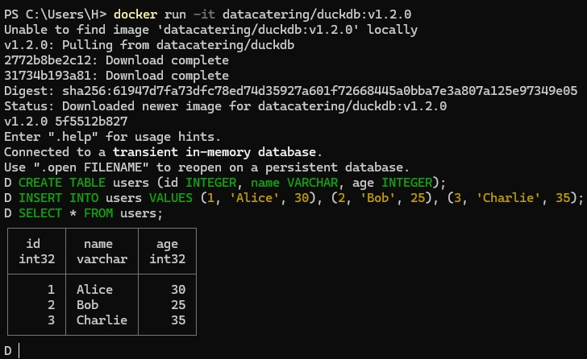

<h2 style="font-size: 24px; text-align: center; font-weight: bold; color: #2C3E50; border-bottom: 2px solid #2980B9; padding-bottom: 10px; margin-bottom: 20px;">
  FAQs for Docker
</h2>

<hr style="border: none; border-top: 1px solid #2980B9; margin: 10px 0;">
<p style="text-align: center; font-size: 16px; color: #34495E; margin-bottom: 10px;">
  Contributions to expand the FAQ are welcome!
</p>
<hr style="border: none; border-top: 1px solid #2980B9; margin: 10px 0;">


### <a id="table-of-contents"></a>Table of Contents

| No. | Questions |
| --- | --------- |
| 1 | [How do Docker, images, containers, and Dockerfiles interact?](#how-do-docker-images-containers-and-dockerfiles-interact) |
| 2 | [What does standardized environments mean?](#what-does-standardized-environments-mean) |
| 3 | [Can you give an example of Continuous Integration (CI)?](#can-you-give-an-example-of-continuous-integration-ci) |
| 4 | [What is Docker client?](#what-is-docker-client) |
| 5 | [What is Docker Daemon?](#what-is-docker-daemon) |
| 6 | [What are Docker Registries?](#what-are-docker-registries) |
| 7 | [What are Docker Objects?](#what-are-docker-objects) |
| 8 | [How does Docker handle image retrieval and container creation?](#how-does-docker-handle-image-retrieval-and-container-creation) |
| 9 | [How to use Docker to run a container with DuckDB inside it?](#how-to-use-docker-to-run-a-container-with-duckdb-inside-it) |
| 10 | [What are layers in Docker images?](#what-are-layers-in-docker-images) |


--- 

## How do Docker, images, containers, and Dockerfiles interact?

> **Docker is a tool that helps in creating, deploying, and running applications using containers. Here's a breakdown of the key concepts:**

> - **Images**: Templates for containers. They describe what should be inside a container, including the OS, software, and settings.
> - **Containers**: Isolated environments where your app runs. They are like mini-computers with everything your app needs to work, but they are lightweight and take up little space.
> - **Dockerfile**: A text file with instructions for building an image. It tells Docker what software to install, how to set up the environment, and how to run the app inside the container.

**[ Back to the question in the Table ⬆ ](#table-of-contents)**

---

## What does standardized environments mean?

> **Standardized environments simply mean creating a consistent setup for running applications.** 
> 
> If you develop an app on your computer, you want it to work the same way when it's run on someone else's computer. By using standardized environments, you ensure that everything is the same everywhere.

**[ Back to the question in the Table ⬆ ](#table-of-contents)**

--- 

## Can you give an example of Continuous Integration (CI)?

> **Continuous Integration (CI) involves automatically building and testing code every time changes are pushed to a shared code repository.**
> 
> Developers work on different features and push their changes to a shared code repository (like GitHub). Every time changes are pushed, an automated system (like Jenkins, GitLab, or GitHub Actions) automatically builds and tests the code to catch bugs early.

**[ Back to the question in the Table ⬆ ](#table-of-contents)**

--- 

## What is Docker client?

> **Docker client is the user interface.** It's what you interact with directly. In Docker, it's the tool you type commands into, like `docker run` or `docker build`.

**[ Back to the question in the Table ⬆ ](#table-of-contents)**

--- 

## What is Docker Daemon?

> **Docker Daemon listens for requests from the client and carries them out in the background.** 
> So, the client is you giving instructions, and the daemon is the one that follows those instructions and does the work.

**[ Back to the question in the Table ⬆ ](#table-of-contents)**

--- 

## What are Docker Registries?

> **Docker Registries are places where Docker images are stored.** For example, Docker Hub is a popular registry. You can pull (download) or push (upload) images here.

**[ Back to the question in the Table ⬆ ](#table-of-contents)**

--- 

## What are Docker Objects?

> **Docker Objects are things you work with in Docker, like:**
> 
> - **Images**: Templates to create containers.
> - **Containers**: Running instances of an image.

**[ Back to the question in the Table ⬆ ](#table-of-contents)**

--- 

## How does Docker handle image retrieval and container creation?

> **First, Docker looks for the image.** If Docker couldn't find the image on your computer, it downloads it from Docker's registry. Once all layers are downloaded, Docker then creates and runs the container in the background.

**[ Back to the question in the Table ⬆ ](#table-of-contents)**

---

## How to use Docker to run a container with DuckDB inside it?

> **To use Docker to run a container with DuckDB inside it, run the following command:**
> 
> ```
> docker run -it datacatering/duckdb:v1.2.0
> ```
>- **datacatering/duckdb:v1.2.0**: This is the Docker image to use.
>    - **datacatering/duckdb**: The name of the Docker image.
>    - **v1.2.0**: The version of DuckDB (in this case, version 1.2.0).

**What Happens When You Run the Command:**
> 1. Docker looks for the image **datacatering/duckdb:v1.2.0** on your local machine.
> 2. If the image is not present, Docker will download it from Docker Hub (a cloud-based repository).
> 3. Once downloaded, Docker creates and starts a container from the image.
> 4. An interactive terminal opens with DuckDB running.

**Inside the Terminal:**
> - You can run SQL commands (e.g., `CREATE TABLE`, `SELECT * FROM`).
> - By default, DuckDB is an in-memory database.

**When You're Done:**
> - Exit the DuckDB instance by typing `.exit`.

**Example:**
> - Docker pulls the DuckDB image if it is not already downloaded.
> - The DuckDB shell opens, showing the prompt `D`.
> - You can now run SQL queries.
> 
> 

**[ Back to the question in the Table ⬆ ](#table-of-contents)**

---

## What are layers in Docker images?

> **Docker images are built step by step, with each step adding a layer. Here's a breakdown of how layers work:**

> - **Base Image**: The starting point of a Docker image, typically containing a minimal operating system or application stack (e.g., Python, Node.js).
> - **Layers**: Each command in the Dockerfile, such as `FROM`, `RUN`, or `COPY`, adds a new layer. A layer represents a set of changes to the image, such as installing software, modifying files, or configuring settings.
> - **Stacked Layers**: Layers are stacked on top of one another, with each new layer building upon the previous ones, eventually creating the final image.

**[ Back to the question in the Table ⬆ ](#table-of-contents)**

---


